# 🎬 Movie Note (Java) 

**Movie Note** is my personal pet project, created in 2020. The application is designed for discovering, viewing, and managing movies and TV shows. This project showcases my expertise in Android development and the implementation of the MVVM architecture using modern technologies.

---

## 📱 Key Features

- **Search for movies and TV shows** using [The Movie Database (TMDb) API](https://www.themoviedb.org/).
- **Detailed information** about movies and TV shows, including:
  - Cast and crew details.
  - Similar movies/TV shows.
  - Number of seasons and episodes for TV shows.
  - Watch trailers on YouTube.
- **User-specific features**:
  - Google Authentication (via Firebase).
  - Mark movies as "favorites."
  - Add personal notes for watched movies (saved in Firebase Realtime Database).
- **User-friendly and intuitive interface** for seamless interaction.

---

## 🛠️ Technologies Used

### Architecture
- **MVVM (Model-View-ViewModel)** – for separating app logic, improving testability, and enhancing maintainability.

### Programming Language
- **Java** – the primary language of the project.

### Core Libraries and Tools
- **Firebase**:
  - Authentication – for user sign-in.
  - Realtime Database – for storing user notes.
  - Storage – for managing user data.
- **Retrofit** – for REST API communication (TMDb).
- **Glide** – for image loading and display.
- **Paging Library** – for efficient pagination.
- **Dagger 2** – for dependency injection.
- **RxJava** – for reactive programming.
- **Navigation Component** – for easy navigation between screens.

### UI Components
- **Material Design** – for modern and attractive UI elements.
- **ConstraintLayout** – for flexible and optimized layouts.

---

## 📂 Dependencies

The full list of dependencies is available in the `build.gradle` file.

---

## 📸 Application Screenshots

### Navigation Component Screenshot
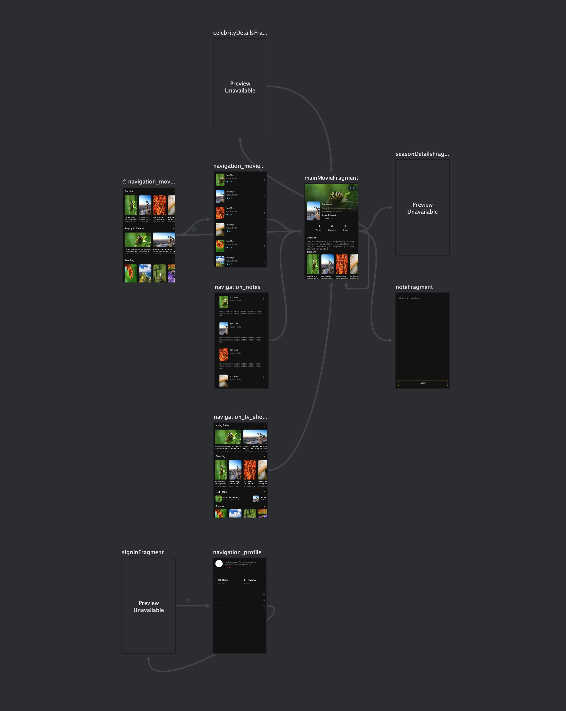

### Other Screenshots
|    | 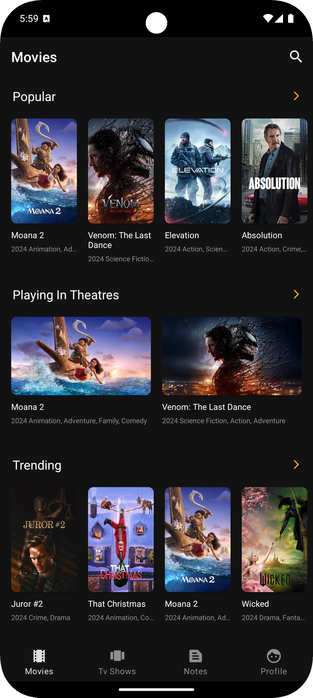   | 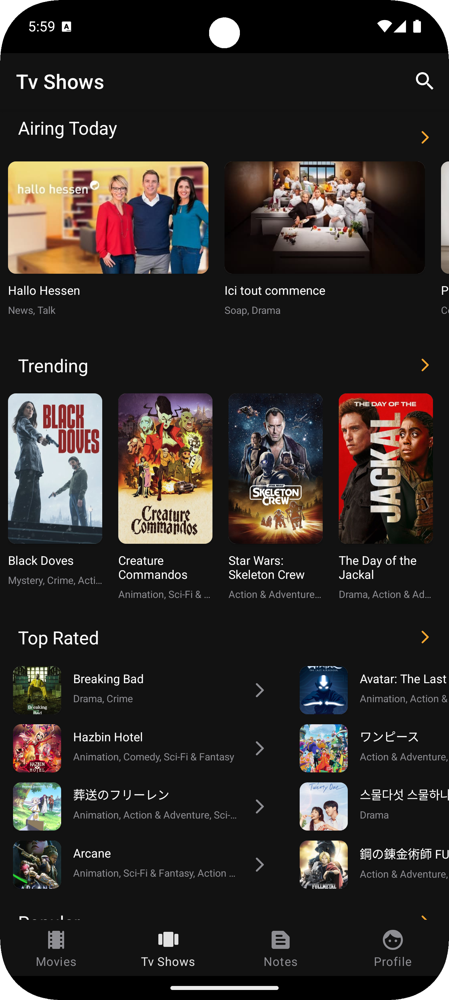   |
|-----------------------------|-----------------------------|-----------------------------|
| 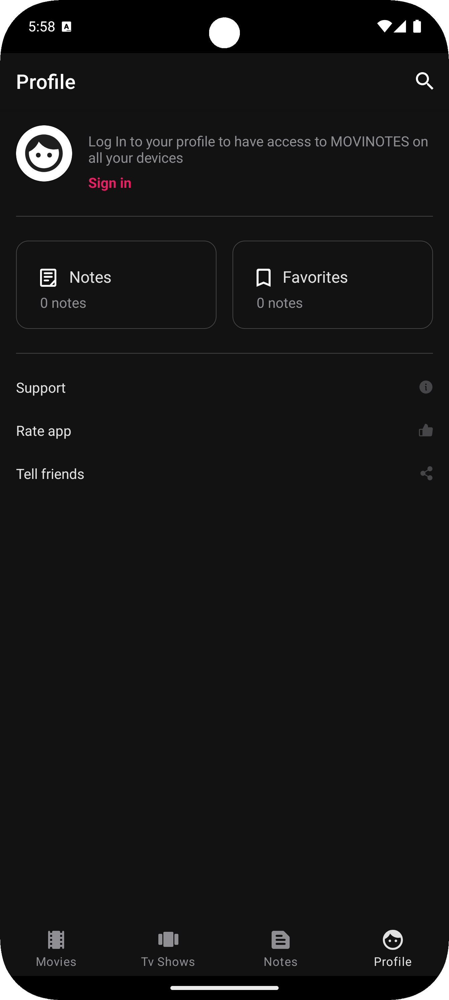   | 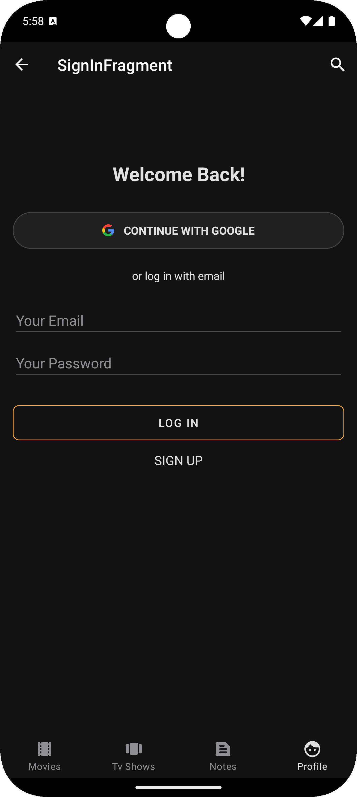   | 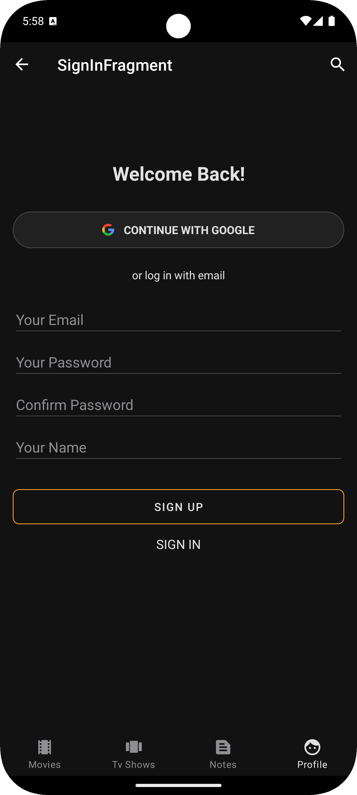   |
| 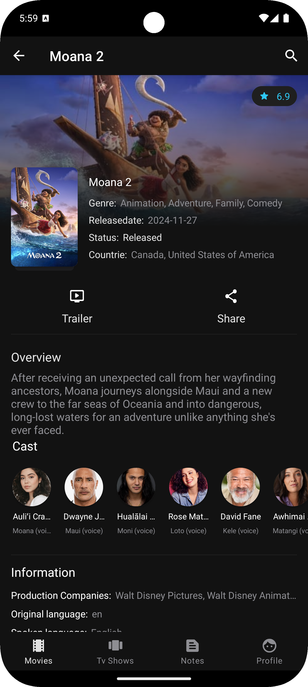   | 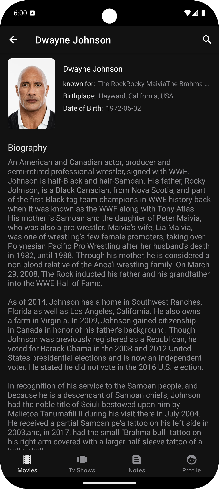   | 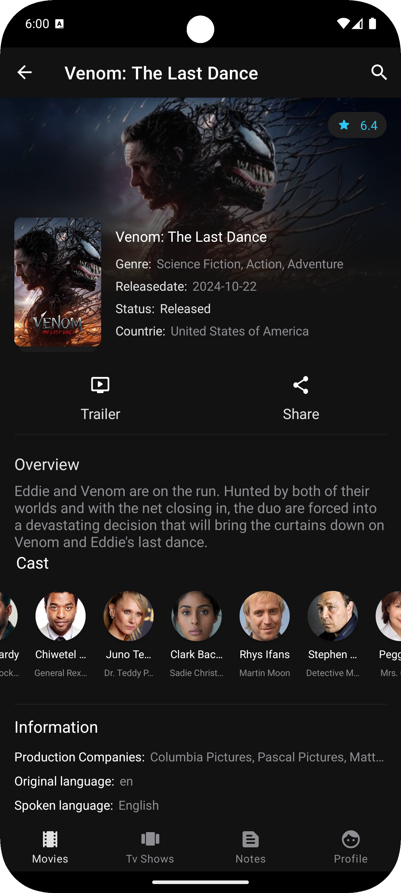   |
| 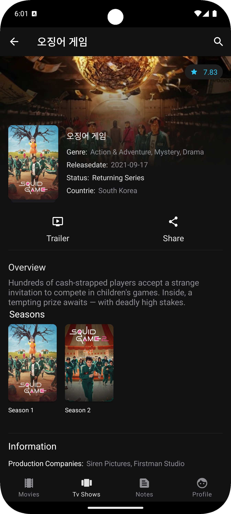 | 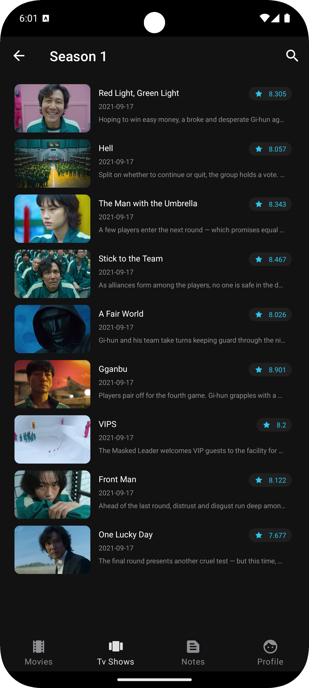 | 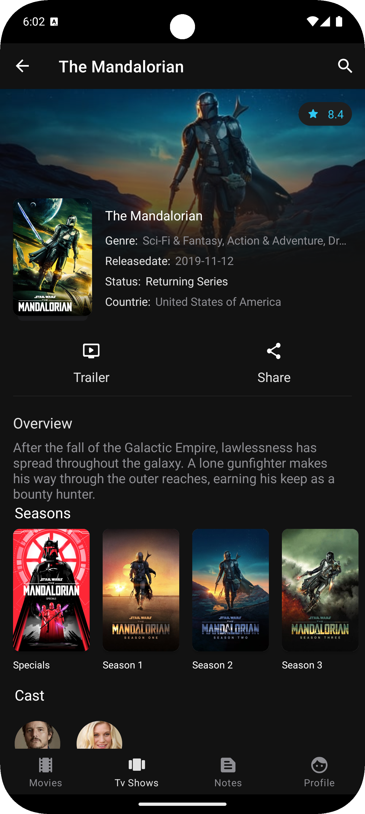 |


---

## 📅 About the Project

- Development Year: **2020**
- Project Type: **Personal project**
- Purpose: Showcase my expertise in Android development and popular libraries.

---

## 🚀 How to Run the Project

1. Clone the repository.
2. Configure a Firebase project and add the `google-services.json` file to the `app` folder.
3. Register on [TMDb](https://www.themoviedb.org/) and obtain an API key.
4. Add the API key to `gradle.properties`:
   ```properties
   API_KEY=your_api_key_here

## 👨‍💻 About Me

**I am an Android developer** with experience working on diverse projects. This project was created to demonstrate my expertise and explore new technologies. I would be happy to hear your feedback or answer any questions! 😊